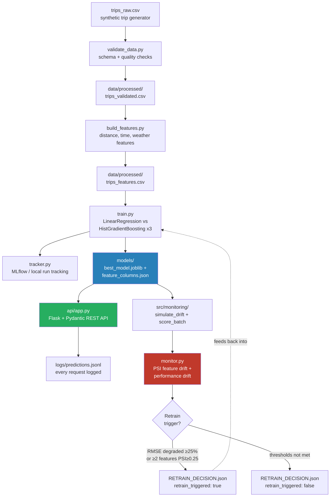

# ETA / Delivery Time Prediction — End-to-End ML Pipeline

**Course:** Machine Learning Engineering (PCAM* ZC412) — Mini-Project EC-1
**Flavor:** A — Delivery / Ride ETA Prediction

An end-to-end ML pipeline that ingests trip data, validates and engineers
features, trains and compares models to predict trip duration, serves the
best model as a REST API, and monitors it in production for drift —
including a simulated festival/rush-hour surge and a documented retraining
trigger.

## Architecture



**Pipeline stages, week by week:**

| Week | Module | What it does |
|------|--------|---------------|
| 1 | M2 — Data | Generate/ingest raw trips, validate schema & quality, engineer features, version the dataset |
| 2 | M3 — Experimentation | Train & compare 4 models, track params/metrics/artifacts per run |
| 3 | M4 — Deployment | Package the best model, serve it via a REST API, validate inputs, handle errors |
| 4 | M5 — Monitoring | Simulate a drift event, score it, detect feature/performance drift, apply a retraining trigger |

## Project Structure

```
eta-ml-project/
├── src/
│   ├── data/            # generate_synthetic_data.py, validate_data.py, version_dataset.py
│   ├── features/        # build_features.py, serving_features.py (shared train/serve logic)
│   ├── models/          # train.py, version_model.py, reproduce_run.py, plot_comparison.py
│   ├── tracking/        # tracker.py — MLflow-compatible experiment tracker
│   └── monitoring/       # simulate_drift.py, score_batch.py, monitor.py  (Week 4)
├── api/                 # app.py (Flask REST API), benchmark.py
├── data/                # raw/, processed/, DATA_VERSIONS.json
├── models/               # trained model artifacts + MODEL_VERSIONS.json
├── monitoring/            # drift simulation outputs, monitoring_report.{json,png}, RETRAIN_DECISION.json
├── reports/               # model_comparison.{json,png}
├── logs/                 # predictions.jsonl (live API request log)
├── docs/                  # sample_api_calls.txt, latency_benchmark.txt, postman_collection.json
├── tests/                 # unit tests (pytest / unittest)
├── Dockerfile
└── requirements.txt
```

## Setup

```bash
python -m venv venv && source venv/bin/activate   # or venv\Scripts\activate on Windows
pip install -r requirements.txt
```

## Running the Pipeline End-to-End

```bash
# Week 1 — data: generate, validate, engineer features, version
python src/data/generate_synthetic_data.py
python src/data/validate_data.py
python src/features/build_features.py
python src/data/version_dataset.py

# Week 2 — train & compare models (4 tracked runs)
python src/models/train.py
python src/models/plot_comparison.py

# Week 3 — serve the best model
python api/app.py
# in another terminal:
curl http://127.0.0.1:5000/health
curl -X POST http://127.0.0.1:5000/predict -H "Content-Type: application/json" \
  -d '{"pickup_datetime":"2025-03-15T18:30:00","pickup_lat":12.95,"pickup_lon":77.60,"dropoff_lat":12.98,"dropoff_lon":77.63,"weather":"rain","temperature_c":24.0}'

# Week 4 — simulate drift, score it, monitor, decide on retraining
python src/monitoring/simulate_drift.py
python src/monitoring/score_batch.py
python src/monitoring/monitor.py
```

Or with Docker (API only):
```bash
docker build -t eta-prediction-api .
docker run -p 5000:5000 -v $(pwd)/logs:/app/logs eta-prediction-api
```

## Running Tests

```bash
python -m pytest tests/ -v
# or: python -m unittest discover -s tests -v
```

## Week 2 — Experimentation & Reproducibility

Four tracked runs compared on a held-out test set (RMSE = lower is better):

| Run | Model | MAE (min) | RMSE (min) | R² |
|---|---|---|---|---|
| linear_regression | LinearRegression | 4.04 | 5.30 | 0.902 |
| **gradient_boosting_default** ⭐ | HistGradientBoostingRegressor | **3.32** | **4.19** | **0.939** |
| gradient_boosting_tuned_shallow | HistGradientBoostingRegressor (depth=4) | 3.32 | 4.19 | 0.939 |
| gradient_boosting_tuned_deep | HistGradientBoostingRegressor (depth=8, lr=0.05) | 3.32 | 4.19 | 0.938 |

`gradient_boosting_default` was selected as the best model (lowest RMSE). Every
run's params, metrics, and seed (42, used everywhere for reproducibility) are
logged via `src/tracking/tracker.py`; `src/models/reproduce_run.py` reproduces
a chosen run from its logged config. See `reports/model_comparison.json` /
`.png` for the full comparison.

## Week 3 — Deployment

- **Framework:** Flask + Pydantic (not FastAPI — FastAPI wasn't installable in
  the offline sandbox this was built in; Pydantic still gives the same
  request-schema validation FastAPI would provide for free — see the
  docstring in `api/app.py`).
- **Endpoints:** `GET /health`, `POST /predict`.
- **Validation & error handling:** malformed JSON → 400, schema/range
  violations → 422 with field-level detail, unexpected errors → 500 (no
  internals leaked, logged server-side).
- **Latency:** mean 16.78 ms / p95 31.98 ms on Flask's single-threaded dev
  server (200 sequential requests) — see `docs/latency_benchmark.txt`.
  For real throughput, swap the dev server for gunicorn/uvicorn workers (noted
  in the Dockerfile).
- Every request is logged to `logs/predictions.jsonl` — this is the direct
  input the Week 4 monitoring stage consumes.
- Sample requests/responses: `docs/sample_api_calls.txt`; a ready-to-import
  collection: `docs/postman_collection.json`.

## Week 4 — Monitoring, Drift & Retraining

**Drift scenario simulated:** a festival / rush-hour surge
(`src/monitoring/simulate_drift.py`) — rush-hour trip share rises from ~35%
to ~65-75%, storm/rain weather roughly triples, rush-hour congestion
worsens (1.6x → 2.1x slowdown), and average trip distance rises ~20%.

**Monitoring signals** (`src/monitoring/monitor.py`):
1. **Feature drift — Population Stability Index (PSI)** per feature,
   comparing the drifted batch to the training-time reference distribution.
   `PSI < 0.10` = stable, `0.10–0.25` = moderate shift, `≥0.25` = major
   shift. This is the standard metric used for population monitoring on
   banking risk models, applied here to ML feature monitoring.
2. **Performance drift** — MAE/RMSE on the drifted batch vs. the baseline
   test-set metrics recorded in `reports/model_comparison.json`.

**Retraining trigger — rule-based and documented:**
Retrain is triggered if **either**:
  - RMSE on incoming traffic is ≥1.25x the baseline test RMSE (≥25%
    relative accuracy degradation), **or**
  - 2 or more features show a major PSI shift (≥0.25)

Two independent conditions — a direct accuracy signal and a leading
distribution-shift signal — reduce false triggers from any single noisy
metric, and the second condition lets us flag likely future degradation even
before enough labelled outcomes exist to measure accuracy directly.

**Result on the simulated surge:** MAE rose from 3.32 → 18.29 min (5.5x
worse); `hour_of_day` and `is_rush_hour` (and, more loosely,
`time_of_day_bucket_evening`/`night`) showed major PSI shifts. Both trigger
conditions fired independently — retrain was correctly recommended. Full
numbers: `monitoring/monitoring_report.json`; decision:
`monitoring/RETRAIN_DECISION.json`; visual: `monitoring/monitoring_report.png`.

## Demo

A 5–7 minute walkthrough should cover, in order: (1) run the Week 1–2 scripts
and show `reports/model_comparison.png`; (2) start the API and run a couple
of `curl` calls from `docs/sample_api_calls.txt`, including a validation
error; (3) run the three Week 4 scripts and open `monitoring_report.png`,
pointing out the PSI bars crossing the major-shift line and the retrain
decision in `RETRAIN_DECISION.json`.

## Design Notes & Trade-offs

- **Synthetic data over Kaggle NYC Taxi** — explicitly permitted by the
  brief; lets the whole pipeline run without external downloads and gives
  full control over the ground-truth process, which is what makes the Week 4
  drift scenario precisely targeted rather than guessed at.
- **Flask over FastAPI** — environment constraint (no PyPI access in the
  original dev sandbox), not a design preference; Pydantic still provides
  schema validation. See `api/app.py` docstring.
- **HistGradientBoostingRegressor over XGBoost** — same environment
  constraint; same algorithm family (histogram-based gradient-boosted
  trees), swappable for `xgboost.XGBRegressor` with no structural change to
  `train.py`.
- **MLflow-optional tracker** (`src/tracking/tracker.py`) — uses real MLflow
  when installed, transparently falls back to an MLflow-compatible local
  JSON tracker otherwise. `train.py` is unaware of which backend is active.

## References

- T1: *Machine Learning Production Systems*, Robert Crowe et al., O'Reilly, 2024
- T2: *Machine Learning Engineering*, Andriy Burkov, 2020
- R1: *Machine Learning Engineering with Python* (2nd ed.), Andrew P. McMahon, Packt, 2023
